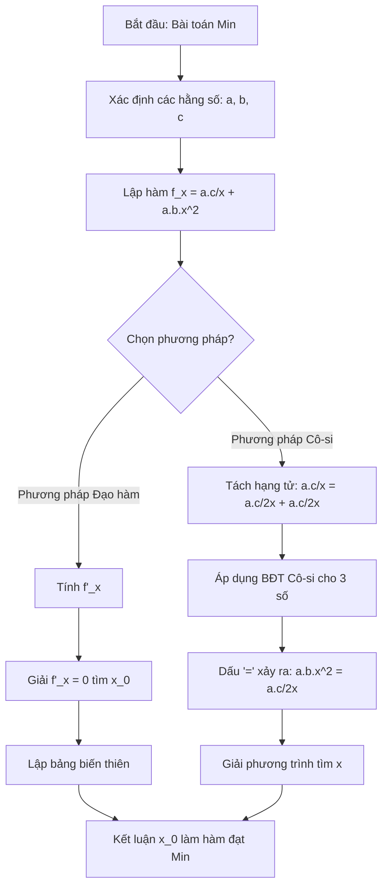
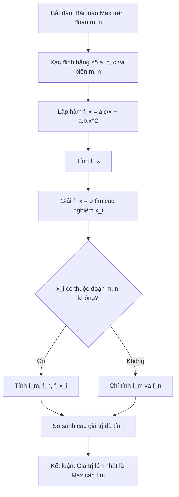

# NHẬT KÝ HỌC TẬP: BÀI TOÁN TỐI ƯU HÓA CHI PHÍ

**Tên đề thi:** Đề thi thử TN THPT thành phố Đà Nẵng năm 2025-2026
**Đường dẫn tệp:**

---

## 0. Đề bài gốc (Câu 4 - Phần III)
> Trong ngành hàng hải, lượng nhiên liệu tiêu thụ của một con tàu trong một đơn vị thời gian xấp xỉ tỷ lệ thuận với lập phương vận tốc của nó. Một tàu chở hàng xuất phát từ cảng Singapore đi đến cảng Tiên Sa cách 1000 hải lý. Gọi v (hải lý/giờ) là vận tốc của tàu $(v>0)$. Dữ liệu kỹ thuật cho thấy chi phí nhiên liệu vận hành của con tàu là 0,02. v³ $(USD/gi\dot{\sigma})$. Các chi phí vận hành cố định khác như lương thuyền viên, khấu hao, bảo hiểm, ... không phụ thuộc vào vận tốc tàu là 625 USD/giờ. Hỏi thuyền trưởng cần duy trì vận tốc trung bình là bao nhiêu hải lý/giờ để tổng chi phí cho toàn bộ chuyến đi là thấp nhất?

---

## 1. Format Đề Bài Tổng Quát

### Dạng 1: Bài toán tối ưu chi phí NHỎ NHẤT (Không giới hạn miền)
> Một [A] cần thực hiện [B] với tổng [C] là $a$ [đơn vị 1]. Gọi $x$ [đơn vị 2] là [D] ($x > 0$). Dữ liệu cho thấy chi phí $Y$ tỷ lệ thuận với lập phương của $x$ ở mức $b \cdot x^3$ [đơn vị 3]. Các khoản chi phí $X$ không phụ thuộc vào $x$ là $c$ [đơn vị 3]. Hỏi cần duy trì $x$ ở mức bao nhiêu [đơn vị 2] để tổng chi phí cho toàn bộ [B] là thấp nhất?

### Dạng 2: Bài toán tối ưu chi phí LỚN NHẤT (Có giới hạn miền vận hành)
> Một [A] cần thực hiện [B] với tổng [C] là $a$ [đơn vị 1]. Gọi $x$ [đơn vị 2] là [D]. Do giới hạn kỹ thuật, hệ thống chỉ cho phép thiết lập $x$ trong đoạn từ $m$ [đơn vị 2] đến $n$ [đơn vị 2]. Biết chi phí $Y$ là $b \cdot x^3$ [đơn vị 3] và chi phí $X$ là $c$ [đơn vị 3]. Hỏi cần thiết lập $x$ ở mức nào để tổng chi phí cho toàn bộ [B] đạt mức cao nhất?

---

## 2. Bảng Hệ Thống Công Thức

Hàm tổng chi phí cho toàn bộ quá trình được thiết lập theo phương trình trọng tâm sau:

$$f(x) = \left( c + b \cdot x^3 \right) \cdot \frac{a}{x}$$

| Đại lượng / Công thức | Ý nghĩa thực tiễn | Phân loại |
| :--- | :--- | :--- |
| $t = \frac{a}{x}$ | Tổng hệ số quy đổi (thường là Thời gian hoặc Số lượng tổng). | Tối thiểu |
| $f(x) = \frac{a \cdot c}{x} + a \cdot b \cdot x^2$ | Hàm tổng chi phí sau khi khai triển (Dùng để tính toán). | Tối thiểu |
| $f'(x) = 2 \cdot a \cdot b \cdot x - \frac{a \cdot c}{x^2}$ | Đạo hàm cấp 1 dùng để tìm điểm cực trị. | Mở rộng |
| $U + V + W \ge 3\sqrt[3]{U \cdot V \cdot W}$ | Bất đẳng thức Cô-si cho 3 số thực không âm. | Mở rộng |

---

## 3. Sơ Đồ Thuật Toán (Flowcharts)
### Source code Mermaid (Dùng để dán vào Draw.io)

**Code cho Sơ đồ Min:**

**Code cho Sơ đồ Max:**

---

## 4. Phương Pháp Giải Xử Lý Hàm Số

### Hướng 1: Phương pháp giải tích (Đạo hàm) - Áp dụng cho cả 2 dạng
1. Thiết lập hàm tổng chi phí $f(x)$.
2. Lấy đạo hàm $f'(x)$.
3. Giải phương trình $f'(x) = 0$ để tìm điểm tới hạn $x_0$.
4. **Xử lý Dạng 1 (Tìm Min):** Lập bảng biến thiên toàn trục số dương $(0; +\infty)$, kết luận $x_0$ là điểm tối ưu.
5. **Xử lý Dạng 2 (Tìm Max):** Loại bỏ những nghiệm $x_0$ không nằm trong đoạn $[m; n]$. Tính các giá trị $f(m)$, $f(n)$, và $f(x_0)$. So sánh để tìm giá trị lớn nhất.

### Hướng 2: Phương pháp đại số (Bất đẳng thức Cô-si) - Chỉ tối ưu cho Dạng 1
1. Viết hàm số dạng khai triển: 

$$f(x) = a \cdot b \cdot x^2 + \frac{a \cdot c}{x}$$

2. Tách hạng tử chứa hằng số $c$ làm đôi để cân bằng bậc của ẩn số $x$: 

$$f(x) = a \cdot b \cdot x^2 + \frac{a \cdot c}{2x} + \frac{a \cdot c}{2x}$$

3. Áp dụng Cô-si cho 3 số dương. Chi phí đạt mức thấp nhất (dấu "=" xảy ra) khi 3 hạng tử bằng nhau:

$$a \cdot b \cdot x^2 = \frac{a \cdot c}{2x} \Rightarrow x^3 = \frac{c}{2b} \Rightarrow x = \sqrt[3]{\frac{c}{2b}}$$

---
